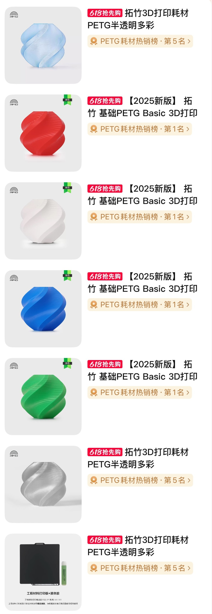
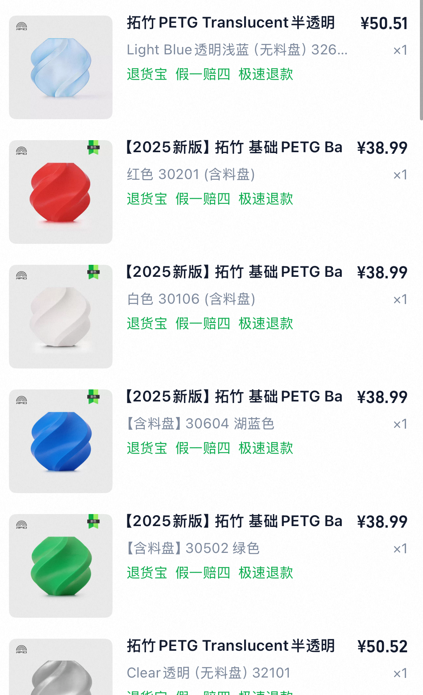
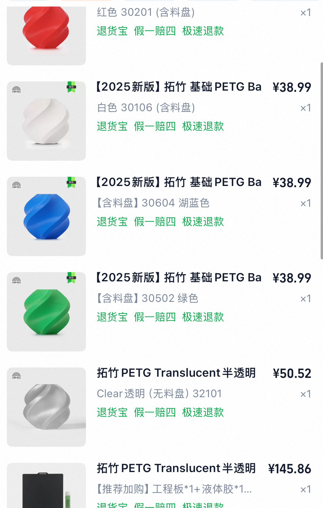

# 3D打印实验耗材购买

- 申报日期: 2026-05-26
- 申报状态: 待提交
- 申报结果: 待补充
- 成功情况: 待补充
- 负责人: 待补充
- 申报书: [申报书.md](./申报书.md)

## 图片文案资料

### 商品信息

- 商品名称: 拓竹 PETG Translucent 半透明多彩、拓竹基础 PETG Basic、工程材料打印板+液体胶
- 申报名称: 3D打印实验耗材购买
- 选定规格: PETG 半透明浅蓝、PETG Basic 红/白/湖蓝/绿、PETG 半透明 Clear、工程材料打印板+液体胶
- 主要用途: 用于实验室样机外壳、传感器支架、雷达/生理信号采集装置固定件、线缆整理件、灯具/柔光扩散件和结构验证件制作。
- 资料来源: 下载截图 `IMG_4102.JPG`、`IMG_4103.PNG`、`IMG_4104.PNG`，截图显示拓竹官方旗舰店购物车/分享清单及对应价格。

### 图片

- 商品清单截图: 
- 商品价格截图上半部分: 
- 商品价格截图下半部分: 

### 文案

本项目拟采购一批 3D 打印实验耗材，用于实验室样机结构件、固定支架和装配辅助件的快速制作。当前实验室涉及雷达采集、心音心电同步采集、自研控制板卡、边缘计算终端等多类硬件联调，现场经常需要小批量、非标准、可快速修改的外壳、支架、垫片、转接板固定件和线缆整理件。3D 打印耗材能够把结构修改周期从外协加工缩短为实验室内快速验证，有助于提高样机迭代效率。

本次耗材以 PETG 为主。PETG 相比普通 PLA 具有更好的韧性、耐冲击性和一定耐温能力，适合制作需要反复拆装、承受线缆拉力和固定板卡的实验结构件。多种颜色耗材便于区分不同实验模块、不同样机版本和不同线缆路径；半透明材料适合观察内部走线、指示灯、接口位置和结构干涉情况，也可用于制作小型实验灯具外壳、指示灯罩和柔光扩散件；工程材料打印板与液体胶用于提高打印附着稳定性，减少打印失败和翘边。

### 资料提取结论

| 资料项 | 访问结果 | 对申报的作用 |
| --- | --- | --- |
| 下载截图 | 显示拓竹官方旗舰店耗材购物清单 | 支撑采购对象与规格 |
| 价格截图 | 显示 PETG 半透明、PETG Basic 和工程板+液体胶价格 | 支撑预算金额 |
| 商品类型 | PETG 耗材及打印辅助材料 | 支撑样机结构件和实验固定件制作 |

## 申报成功情况

- 当前状态: 待提交
- 结果说明: 待提交后补充
- 复盘记录: 待补充

## 价格情况

| 项目 | 数量 | 单价(CNY) | 小计(CNY) |
| --- | ---: | ---: | ---: |
| 拓竹 PETG Translucent 半透明 Light Blue | 1 | 50.51 | 50.51 |
| 拓竹 PETG Basic 红色 | 1 | 38.99 | 38.99 |
| 拓竹 PETG Basic 白色 | 1 | 38.99 | 38.99 |
| 拓竹 PETG Basic 湖蓝色 | 1 | 38.99 | 38.99 |
| 拓竹 PETG Basic 绿色 | 1 | 38.99 | 38.99 |
| 拓竹 PETG Translucent Clear 透明 | 1 | 50.52 | 50.52 |
| 工程材料打印板+液体胶 | 1 | 145.86 | 145.86 |
| 合计 |  |  | 402.85 |

## 采购理由

- 实验室多类硬件样机需要快速制作支架、固定件、外壳和装配辅助件，3D 打印耗材可显著缩短结构验证周期。
- PETG 材料兼顾韧性、耐冲击性和一定耐温能力，适合实验设备反复拆装和板卡固定场景。
- 多颜色耗材便于区分不同实验模块、样机版本和线缆路径，有利于实验现场管理。
- 半透明材料便于观察内部走线、状态指示灯和结构干涉情况，也适合制作小型实验灯具、指示灯罩和柔光扩散件。
- 工程材料打印板和液体胶可提升打印附着稳定性，减少耗材浪费和打印失败。

## 使用计划

1. 为雷达采集、心音心电同步采集和自研控制板卡制作支架、外壳、固定件和线缆整理件。
2. 对不同样机版本使用不同颜色进行区分，形成结构件版本管理记录。
3. 用半透明材料制作需要观察内部结构、指示灯和接口的调试件，并制作小型实验灯具外壳、指示灯罩或柔光扩散件。
4. 使用工程材料打印板和液体胶提高打印成功率，形成常用材料参数记录。
5. 将打印件用于实验台、便携终端和多传感器联调场景，支撑样机快速迭代。

## 验收标准

- 耗材和打印辅助材料数量、规格与申报清单一致。
- 能够完成实验室常用支架、固定件、外壳和线缆整理件打印。
- 形成至少一批用于采集装置或自研板卡联调的结构件。
- 形成耗材颜色、用途、打印参数和样机版本对应记录。
