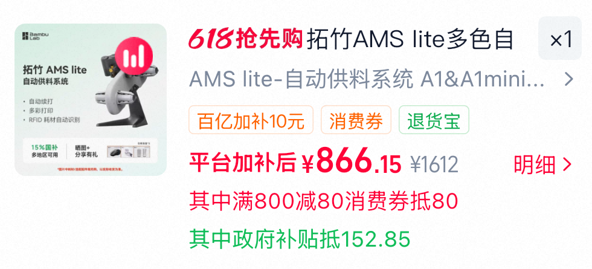

# AMS lite多材料供料系统购买

- 申报日期: 2026-05-26
- 申报状态: 待提交
- 申报结果: 待补充
- 成功情况: 待补充
- 负责人: 待补充
- 申报书: [申报书.md](./申报书.md)

## 图片文案资料

### 商品信息

- 商品名称: 拓竹 AMS lite 多色自动供料系统
- 申报名称: AMS lite 多材料供料系统购买
- 选定规格: AMS lite 自动供料系统，适配 A1 / A1 mini 系列生态，多色/多材料供料
- 主要用途: 用于实验室 3D 打印样机结构件的多材料、多颜色打印和耗材自动切换，提高样机制作效率。
- 资料来源: 下载截图 `IMG_4105.PNG`，截图显示天猫拓竹官方旗舰店购物车选中 AMS lite，平台补贴后价格 ¥866.15。

### 图片

- AMS lite 购物车价格截图: 

### 文案

本项目拟采购 AMS lite 多材料供料系统，用于配合实验室 3D 打印平台开展多颜色、多材料结构件制作。实验室在雷达采集、心音心电同步采集、自研板卡联调和边缘计算终端装配过程中，经常需要带有颜色区分、文字标识、接口标记和材料分区的结构件。AMS lite 可实现多卷耗材接入和自动切换，减少人工换料和重复看守打印过程，提高结构件制作效率。

AMS lite 的价值不只是打印彩色模型，而是把实验室样机结构件制作从单材料单颜色扩展到多材料、多颜色和可标识化打印。对于实验装置而言，不同颜色可用于区分传感器、接口、电源线、数据线和版本编号；不同材料可用于区分刚性结构、支撑材料和需要拆除的辅助结构。该能力有助于形成更清晰的实验装配件，减少样机联调现场的误接和误拆。

## 资料提取结论

| 资料项 | 访问结果 | 对申报的作用 |
| --- | --- | --- |
| 下载截图 | 天猫拓竹官方旗舰店 AMS lite 购物车选中项 | 支撑采购对象 |
| 价格信息 | 平台补贴后 ¥866.15，截图显示原价 ¥1612、消费券和政府补贴抵扣 | 支撑价格记录 |
| 商品用途 | 自动供料系统、多色/多材料打印 | 支撑样机结构件制作效率和标识化管理 |

## 申报成功情况

- 当前状态: 待提交
- 结果说明: 待提交后补充
- 复盘记录: 待补充

## 价格情况

| 项目 | 数量 | 单价(CNY) | 小计(CNY) |
| --- | ---: | ---: | ---: |
| 拓竹 AMS lite 多色自动供料系统 | 1 | 866.15 | 866.15 |
| 合计 |  |  | 866.15 |

## 采购理由

- 多材料供料系统能够减少人工换料，提高实验室结构件连续打印效率。
- 多颜色打印可用于区分实验模块、接口方向、线缆路径和样机版本，降低联调误操作风险。
- 自动供料有利于长时间打印任务稳定进行，减少打印过程中的人工看守。
- 支持带标识、带分区、带装配提示的结构件制作，使实验样机更便于团队协作和导师检查。
- 该设备可长期服务实验室 3D 打印平台，不属于一次性耗材，具备公共工具属性。

## 使用计划

1. 配合 3D 打印平台制作多颜色样机外壳、传感器支架、线缆标识件和接口方向标识件。
2. 为雷达采集、心音心电采集、自研控制板卡等不同模块建立颜色和材料区分规则。
3. 制作包含文字、颜色标记和装配提示的实验结构件，减少现场联调误接和误拆。
4. 对多材料供料、自动切换、耗材余量管理和打印任务稳定性进行记录。
5. 将设备纳入实验室公共 3D 打印工具体系，服务后续样机迭代和实验装置建设。

## 验收标准

- 设备型号、数量与申报清单一致。
- 能够完成多卷耗材接入和自动切换。
- 能够配合 3D 打印平台完成多颜色或多材料结构件打印。
- 形成至少一件用于实验样机的多颜色标识结构件。
- 形成设备使用记录、材料切换记录和样机结构件应用记录。
