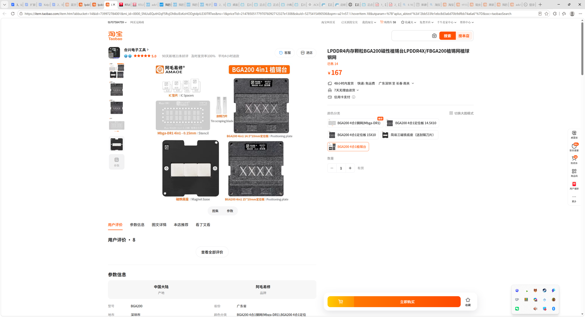

# BGA200内存颗粒返修工具采购

- 申报日期: 2026-05-25
- 申报状态: 待提交
- 申报结果: 待补充
- 成功情况: 待补充
- 负责人: 待补充
- 申报书: [BGA200内存返修工具-申报书.docx](./BGA200内存返修工具-申报书.docx)

## 图片文案资料

### 商品信息

- 商品名称: BGA200 磁性植锡台
- 申报名称: BGA200 内存颗粒植锡与返修工具采购
- 选定规格: BGA200 4合1植锡台
- 主要用途: 用于建立 BGA200 内存颗粒拆焊、植锡、定位、回流和焊后检查的返修工具条件，服务 FPGA、Linux 开发板、边缘计算板等实验平台维护。
- 资料来源: 淘宝桌面版截图记录：BGA200 4合1植锡台 ¥167。

### 图片

- BGA200 植锡台价格截图: 

### 文案

本项目拟采购 BGA200 内存颗粒返修工具，采购对象为 BGA200 4 合 1 植锡台。实验室现有 FPGA 板卡、Linux 开发板和边缘计算板在长期调试中可能出现虚焊、返修、替换和焊盘检查需求；若完全依赖整板替换或外部维修，成本高、周期长，也不利于及时定位硬件问题。通过购置植锡台，可建立从拆颗粒、清焊盘、定位、上锡、回流到焊后检查的基础工具条件，使实验室具备处理 BGA200 封装内存颗粒返修问题的能力。

BGA200 封装焊点密集、定位窗口小，对钢网、底座、磁吸定位和刮锡一致性要求较高。普通镊子、热风枪和通用钢网难以保证重复操作质量，容易出现锡量不均、连锡、少锡和偏位等问题。4 合 1 植锡台能够为返修操作提供相对固定的夹持、定位和上锡条件，降低每次操作的随机性，也便于形成可复用的实验室返修流程记录。

### 资料提取结论

| 资料项 | 访问结果 | 对申报的作用 |
| --- | --- | --- |
| BGA200 植锡台截图 | 选中 BGA200 4合1植锡台，价格 ¥167 | 支撑工具预算 |
| 用途论证 | FPGA、Linux 开发板和边缘计算板常见使用 BGA 封装内存颗粒 | 形成实验室可复用的返修工具能力 |

## 申报成功情况

- 当前状态: 待提交
- 结果说明: 待提交后补充
- 复盘记录: 待补充

## 价格情况

| 项目 | 数量 | 单价(CNY) | 小计(CNY) | 备注 |
| --- | ---: | ---: | ---: | --- |
| BGA200 4合1植锡台 | 1 | 167.00 | 167.00 | 淘宝桌面版截图价格 |
| 合计 |  |  | 167.00 | 商品截图记录价 |

## 采购理由

- BGA200 植锡和定位是内存颗粒返修的关键工序，专用工具能显著提高重复操作和返修验证的成功率。
- 在开发板整板替换成本较高、外部维修周期较长的背景下，建立基础返修工具条件具有明确的成本控制和效率提升意义。
- FPGA、Linux 开发板和边缘计算板常使用 BGA 封装存储器件，返修工具能力可服务多个实验平台。
- BGA200 植锡台作为长期复用工具归档，适合沉淀为实验室硬件维修与返修流程的一部分。
- 该工具金额较低、复用频率高，可补齐实验室在小型 BGA 封装返修中的基础工具短板。

## 使用计划

1. 完成工具到货验收，记录钢网、定位板、磁铁底座和刮刀完整性。
2. 使用废板或测试颗粒开展清焊盘、上锡、定位和回流流程验证。
3. 记录温度曲线、焊膏量、对位误差和常见失败现象。
4. 形成 BGA200 封装返修操作记录，明确工具准备、定位、上锡、回流和焊后检查要点。
5. 将流程照片、成功/失败样例和注意事项补充到本项目 README。

## 验收标准

- BGA200 植锡台数量、规格、外观验收完成。
- 完成至少一次 BGA200 植锡流程验证并形成照片记录。
- 形成一份简短返修流程记录，包括工具准备、焊盘处理、植锡、回流和检查步骤。
- 说明该工具对 FPGA、Linux 开发板和边缘计算板 BGA200 内存颗粒返修场景的适用边界和风险。
