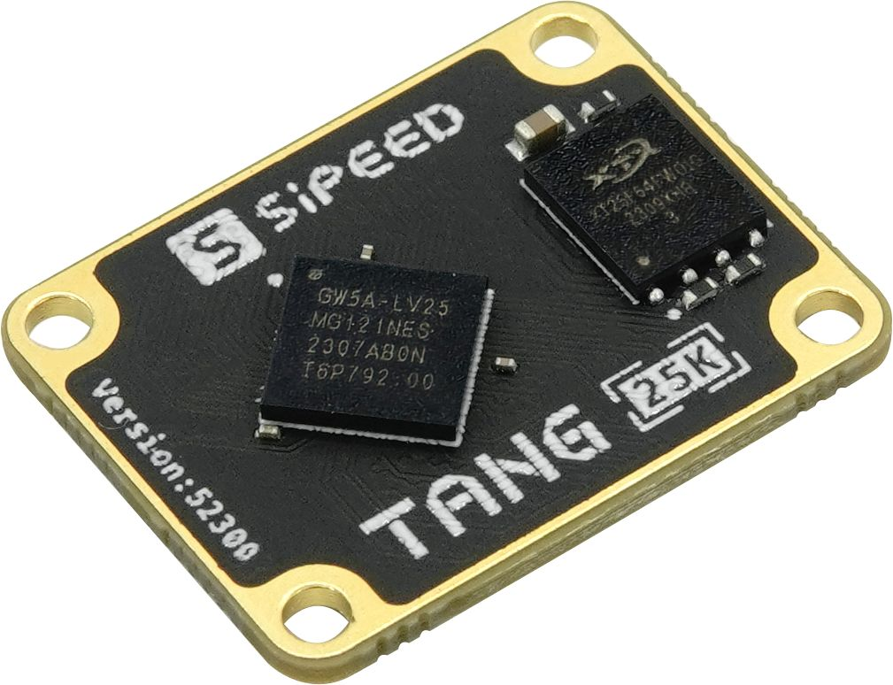
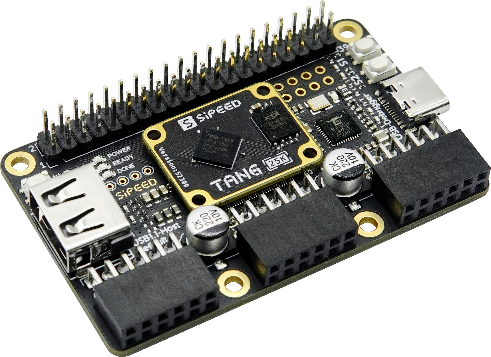
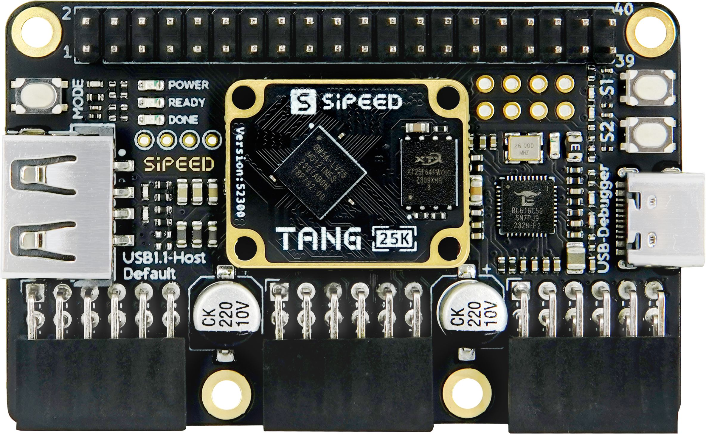
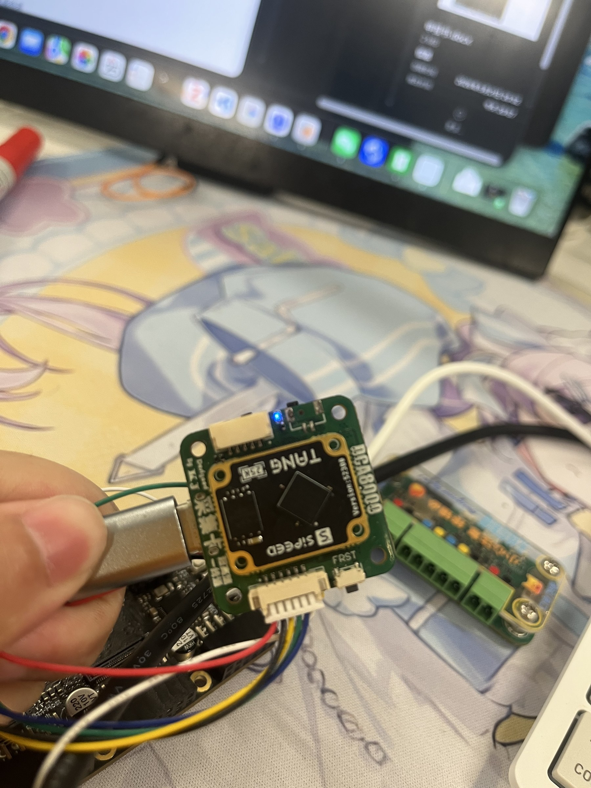

# Tang Primer 25K 雷达 LVDS 采集 FPGA 套件采购

- 申报日期: 2026-05-21
- 申报状态: 待提交
- 申报结果: 待补充
- 成功情况: 待补充
- 负责人: 待补充
- 申报书: [申报书.md](./申报书.md)

## 图片文案资料

### 商品信息

- 商品名称: Sipeed Tang Primer 25K 高云 GW5A RISC-V FPGA 开发板 PMOD SDRAM
- 申报名称: Tang Primer 25K 雷达 LVDS 原始数据采集 FPGA 套件
- 选定规格: Tang Primer 25K 核心板 + 25K Dock 底板套件
- 主要用途: 用于雷达 LVDS 原始数据采集链路验证，并服务自制 USB3.0 雷达采集卡完成与联调。
- 淘宝搜索关键词: `Tang Primer 25K`
- 淘宝记录: 2026-05-21 淘宝桌面版短搜 `Tang Primer 25K`，当前记录价 `¥49.00`，后续以下单页复核为准。
- 官方文档页: https://wiki.sipeed.com/hardware/zh/tang/tang-primer-25k/primer-25k.html
- 官方硬件资料页: https://dl.sipeed.com/shareURL/TANG/Primer_25K
- TI DCA1000EVM 对比资料: https://www.ti.com/tool/DCA1000EVM
- 参考对比: TI DCA1000EVM 官方资料显示其可采集雷达 LVDS 数据，但实时输出路径为 1Gbps Ethernet；本项目面向自制 USB3.0 单线高速雷达采集卡。
- 资料来源: 淘宝桌面版搜索截图；Sipeed 官方 Wiki、硬件资料页和 TI DCA1000EVM 官方资料。

### 图片

- 核心板产品图: 
- Dock 底板产品图: 
- Dock 顶视图: 
- 雷达采集卡实物预览图: 
- 待补充: 自制 USB3.0 雷达采集卡连接关系图，建议保存到 `assets/radar-usb3-connection.png`。

### 文案

本项目拟购置 Tang Primer 25K FPGA 开发套件，包含基于 Gowin GW5A-LV25MG121 的 Tang Primer 25K 核心板及 25K Dock 底板。官方资料显示，该核心板提供 23040 个 LUT4 逻辑单元、23040 个寄存器、1008Kbit B-SRAM、28 个 18x18 乘法器、6 个 PLL、64Mbit NOR Flash、普通 IO 约 75 路和 MIPI 高速 IO；Dock 底板提供板载高速调试器、JTAG+UART、USB-C 接口、USB-A、2x20Pin 插针、3 个 PMOD、按键和 64x40mm 板卡形态。

该套件拟用于雷达 LVDS 原始数据采集前端验证。雷达原始 ADC/LVDS 数据具有并行高速、时序约束严格、对同步和缓存路径敏感等特点，直接用普通 MCU 或上位机软件采集不利于稳定复现链路问题。FPGA 能够在硬件时序层完成 LVDS 接收、帧同步、解串、缓冲、测试 pattern 生成、采样时钟验证和错误计数，为后续自制 USB3.0 雷达采集卡提供可验证的前端逻辑基础。

本采购与自制 USB3.0 雷达采集卡形成直接支撑关系。现有主流雷达原始数据采集方案多围绕专用评估板和以太网回传展开，例如 TI DCA1000EVM 可采集两路或四路 LVDS 雷达数据并通过 1Gbps Ethernet 实时输出。对实验室自制采集卡而言，USB3.0 方案的优势在于接线只需要一根 USB 线即可同时承担高速数据传输和上位机连接管理，接口普及、电脑兼容性好、传输速度高，适合做便携化、低线缆复杂度的雷达原始数据采集卡。

直接在采集卡上集成 FPGA 芯片成功率较低，因此先使用现有 FPGA 核心板贴合验证 LVDS 接收、时序约束、接口映射、测试向量、缓存策略和 USB3.0 数据输出组织方式。该套件的定位不是单纯开发板验证，而是作为自制 USB3.0 雷达采集卡的前端逻辑验证和板级贴合调试平台。待采集链路稳定后，再将验证后的逻辑、接口约束和数据格式固化到自制 USB3.0 雷达采集卡中，降低 PCB 回板后的定位成本，提高采集卡完成概率。

### 资料提取结论

| 资料项 | 访问结果 | 对申报的作用 |
| --- | --- | --- |
| 淘宝搜索页 | 短搜 `Tang Primer 25K` 记录当前价 `¥49.00`，价格后续以下单页复核 | 支撑预算估算和采购对象 |
| Sipeed 官方 Wiki | 说明 Tang Primer 25K 核心板与 25K Dock 底板配套，列出 FPGA 和 Dock 参数 | 支撑技术规格和用途论证 |
| 官方硬件资料页 | 提供规格书、原理图、尺寸图、点位图、3D 模型和管脚资料 | 支撑后续 LVDS 接线、时序约束和采集卡联调 |
| 实物预览图 | 已保存现有核心板贴合雷达采集卡调试的实物照片 | 支撑“先用现有核心板验证 LVDS 接收”的技术路线 |
| TI DCA1000EVM 官方资料 | 可采集雷达 LVDS 数据，实时输出路径为 1Gbps Ethernet | 支撑自制 USB3.0 雷达采集卡的差异化必要性 |

## 申报成功情况

- 当前状态: 待提交
- 结果说明: 待提交后补充
- 复盘记录: 待补充

## 价格情况

| 项目 | 数量 | 单价(CNY) | 小计(CNY) | 备注 |
| --- | ---: | ---: | ---: | --- |
| Tang Primer 25K FPGA 开发套件 | 1 | 49.00 | 49.00 | 当前记录价，核心板 + 25K Dock 套件；后续以下单页复核 |
| 合计 |  |  | 49.00 | 实际以审批后订单及发票为准 |

## 采购理由

- 用于自制 USB3.0 雷达采集卡的 LVDS 前端逻辑验证，避免直接在采集卡上集成 FPGA 芯片导致较低成功率。
- FPGA 适合实现 LVDS 接收、解串、帧同步、缓存、错误计数和数据输出格式组织，为 USB3.0 高速回传提供稳定前端数据流。
- 现有主流成品采集链路多为专用评估板加以太网回传，自制 USB3.0 方案可减少线缆数量，提高电脑连接便利性和便携部署能力。
- 25K 规模足以开展中小型高速采集链路原型验证，成本低，适合作为实验室可复用验证平台。
- Dock 底板提供 PMOD、插针、USB-C 接口和板载调试器，便于快速接线、波形观察和板级贴合验证。
- 官方提供原理图、点位图、尺寸图和管脚资料，便于和自制 USB3.0 雷达采集卡进行接口映射。
- 可形成 LVDS 约束、跨时钟域处理、缓存策略、USB3.0 输出数据格式和高速采集链路调试记录。

## 使用计划

1. 完成 LVDS 接收、解串、帧同步和缓存策略验证，形成自制 USB3.0 雷达采集卡可复用的 FPGA 前端逻辑。
2. 完成雷达原始数据到 USB3.0 输出链路的数据格式定义，明确帧头、帧计数、有效载荷、错误标记和丢帧统计方式。
3. 完成 FPGA 核心板与自制 USB3.0 雷达采集卡的贴合联调，验证接口映射、时钟域转换、缓存深度和高速输出稳定性。
4. 完成一版可用于实验室雷达原始数据采集的 USB3.0 采集卡联调记录，包含连接方式、采集流程、数据保存格式和异常处理。
5. 将验证后的 LVDS 接收逻辑、约束文件、数据输出格式和联调结论沉淀为自制 USB3.0 雷达采集卡的实现资料。

## 验收标准

- 完成自制 USB3.0 雷达采集卡的 FPGA 前端贴合验证。
- 完成 LVDS 原始数据接收、帧同步、缓存和 USB3.0 输出数据格式联调。
- 能够用一根 USB3.0 线完成采集卡与上位机的高速数据连接。
- 形成自制 USB3.0 雷达采集卡的接口映射、数据流路径、联调记录和采集数据样例。
- 商品截图、订单截图和到货照片补充到 `assets/`。
