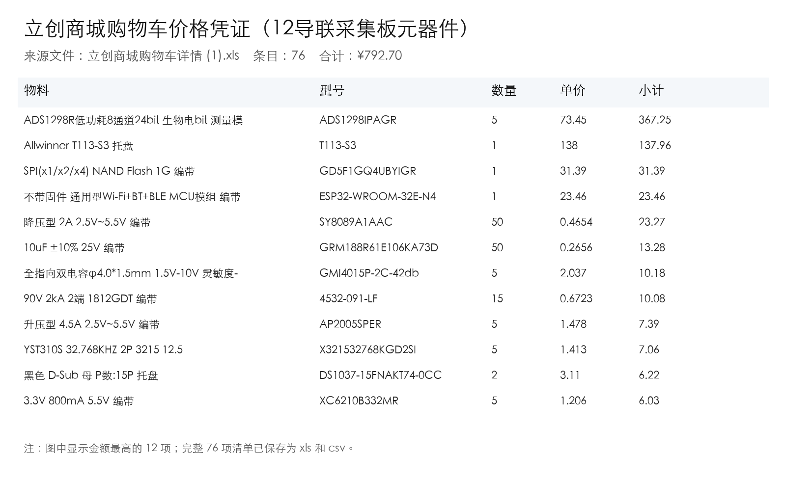
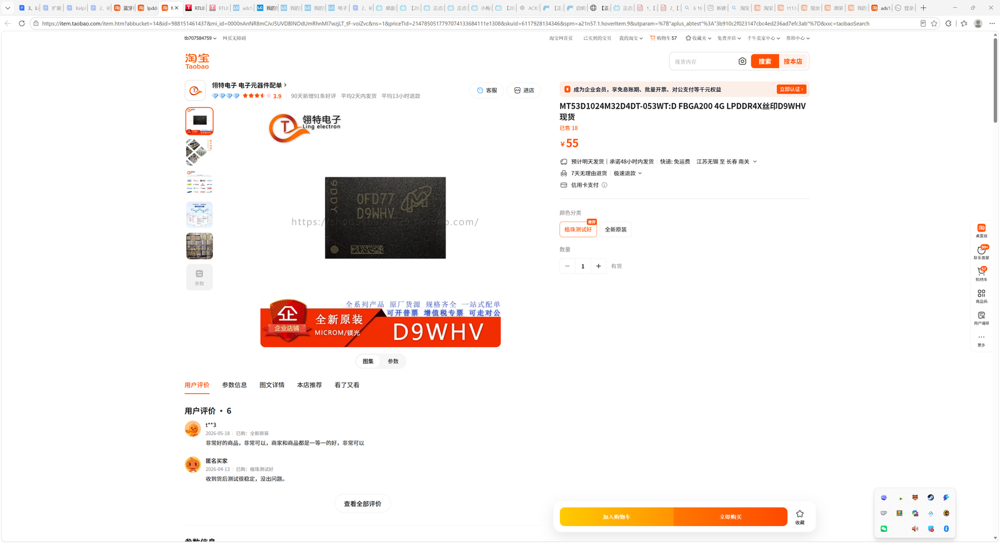

# 实验室电子元器件采集

- 申报日期: 2026-05-25
- 申报状态: 待提交
- 申报结果: 待补充
- 成功情况: 待补充
- 负责人: 待补充
- 申报书: [申报书.docx](./申报书.docx)

## 图片文案资料

### 商品信息

- 商品名称: 立创商城实验室电子元器件购物车及 4G LPDDR4X 内存颗粒
- 申报名称: 实验室电子元器件采购
- 选定规格: ADS1298R AFE、T113-S3、1G NAND、ESP32、连接器、电源、保护与阻容件等 76 项，另含 MT53D1024M32D4DT-053WT:D 4G LPDDR4X FBGA200 内存颗粒 1 颗
- 主要用途: 用于 12 导联心电采集板样机焊接、调试和实验室开发板/FPGA 板卡内存颗粒验证。
- 资料来源: 本地下载文件 `立创商城购物车详情 (1).xls`，解析得到 76 项，合计 792.70 元；淘宝桌面版截图记录 4G LPDDR4X 颗粒价格 55.00 元。

### 图片

- 立创购物车价格凭证: 
- LPDDR4X 内存颗粒价格截图: 

### 文案

本项目拟集中采购实验室近期硬件样机所需电子元器件，重点服务 12 导联心电采集板样机，同时补充一颗 4G LPDDR4X FBGA200 内存颗粒用于开发板、FPGA 板卡和 Linux 边缘计算板的内存颗粒验证。立创清单覆盖生物电模拟前端、主控/通信、存储、电源管理、保护器件、连接器、晶振、咪头和基础阻容件；其中 ADS1298R 是 8 通道 24 bit 生物电测量模拟前端，是多导联心电采集链路的关键器件。LPDDR4X 内存颗粒归入元器件申报后，能与 T113-S3、NAND Flash、ESP32 和基础器件一起形成更完整的实验室电子器件储备，而 BGA200 植锡台则单独作为返修工具申报。

### 资料提取结论

| 资料项 | 访问结果 | 对申报的作用 |
| --- | --- | --- |
| 立创 xls | 可解析 76 项购物车条目，合计 ¥792.70 | 作为元器件预算和清单凭证 |
| 关键 AFE | ADS1298R 5 片，¥367.25 | 支撑 12 导联心电采集核心模拟前端 |
| 主控与存储 | T113-S3、1G SPI NAND、ESP32-WROOM-32E | 支撑采集控制、数据缓存和无线/串口调试 |
| 淘宝内存颗粒截图 | MT53D1024M32D4DT-053WT:D，FBGA200 4G，价格 ¥55.00 | 补充实验室开发板和 FPGA 板卡内存颗粒验证材料 |

## 申报成功情况

- 当前状态: 待提交
- 结果说明: 待提交后补充
- 复盘记录: 待补充

## 价格情况

| 项目 | 数量 | 单价(CNY) | 小计(CNY) | 备注 |
| --- | ---: | ---: | ---: | --- |
| 12导联采集板元器件购物车 | 1批 | 792.70 | 792.70 | 立创商城购物车 76 项，完整清单见 assets/lcsc-cart-20260525.csv |
| MT53D1024M32D4DT-053WT:D 4G LPDDR4X 颗粒 | 1 | 55.00 | 55.00 | FBGA200 封装，用于开发板/FPGA 板卡内存颗粒验证 |
| 合计 |  |  | 847.70 | 当前价格依据本地下载 xls 或淘宝桌面版截图记录，实际支出以下单页和发票/订单为准 |

## 采购理由

- 12 导联心电采集板需要稳定、可复现的元器件清单，便于样机焊接、调试和后续版本迭代。
- ADS1298R 属于生物电测量核心 AFE，提前采购可降低样机调试时因关键器件缺货造成的延期风险。
- 电源管理、ESD/GDT/TVS、连接器和基础阻容件可支撑完整硬件闭环，而不是只停留在原理图层面。
- LPDDR4X 内存颗粒作为实验室通用电子元器件，可用于学习和验证开发板、FPGA 板卡、Linux 边缘计算板的内存颗粒替换与兼容性。
- 采购数量以小批量样机和损耗余量为目标，适合手工焊接、返修和多轮联调。
- 完整清单归档到仓库后，可为后续 BOM 复盘、板级故障定位和经费申报提供依据。

## 使用计划

1. 按立创购物车清单完成采购和到货核对，记录实际订单金额。
2. 按器件类别分装，优先核对 ADS1298R、T113-S3、NAND Flash、LPDDR4X 内存颗粒、电源芯片和连接器。
3. 完成 12 导联采集板样机焊接，建立上电、电源轨、时钟和通信接口检查表。
4. 完成生物电 AFE 基础采样验证，并记录噪声、导联连接和保护电路问题。
5. 将实际使用、损耗和替代料情况补充回 README，形成下一版 BOM 修订依据。

## 验收标准

- 76 项立创元器件清单、LPDDR4X 内存颗粒价格截图、订单截图和到货照片完整归档。
- 关键器件型号与购物车清单一致，ADS1298R、T113-S3、NAND Flash 等通过外观和数量验收。
- 至少完成一块 12 导联采集板样机的焊接或关键模块焊接验证。
- 形成一次上电与基础采样调试记录，并补充到申报复盘材料中。
