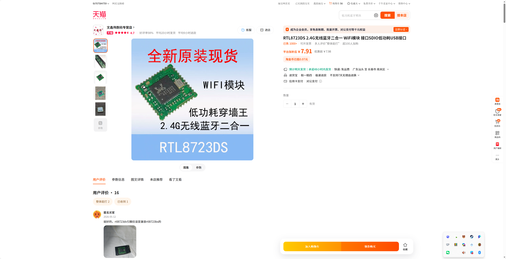
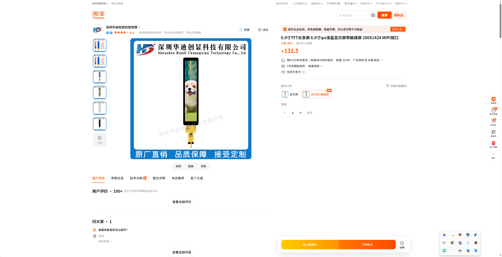

# 实验室电子元器件采集

## 一、需求分析

12 导联心电采集板、雷达板和自制控制板卡均需要稳定、可复现的电子元器件储备，用于样机焊接、上电调试、通信接口验证和后续版本迭代。现有实验室硬件工作同时涉及生物电模拟前端、雷达采集前端、嵌入式控制、人机交互显示和边缘计算终端扩展，因此需要将常用元器件、关键接口器件和板级升级器件集中采购、统一归档。

## 二、目的用途

本次采购用于支撑 12 导联心电采集板、雷达板、自制控制板卡和常用元器件补充。立创购物车元器件用于生物电采集、电源管理、保护、连接、存储和控制链路；LPDDR4X FBGA200 内存颗粒用于 Radxa Cubie A5E 从 1GB 升级到 4GB 的板级验证；RTL8723DS 模块用于自制控制板卡和小型采集节点的 WiFi/蓝牙通信接口；6.9 寸 MIPI 触摸显示屏用于便携式控制面板、雷达板调试界面和样机状态显示。

## 三、实现目标

- 形成覆盖 12 导联采集板、雷达板和自制控制板卡的常用元器件储备，保证关键器件型号、数量和价格可追溯。
- 完成 12 导联心电采集板、雷达板或自制控制板卡样机的焊接、上电和关键模块调试。
- 完成 A5E 由 1GB 向 4GB 内存扩展的板级验证准备，支撑双网口边缘采集终端容量扩展。
## 经费数量

| 项目 | 数量 | 单价(CNY) | 小计(CNY) |
| --- | --- | --- | --- |
| 电子元器件 | 1批 | 987.11 | 987.11 |
| 合计 |  |  | 987.11 |

截图与明细对应表：

| 截图/来源 | 对应物料 | 数量 | 小计(CNY) | 说明 |
| --- | --- | --- | --- | --- |
| LPDDR4X 内存颗粒截图 | MT53D1024M32D4DT-053WT:D 4G LPDDR4X 颗粒 | 1 | 55.00 | 用于 A5E 升级到 4GB 的板级验证 |
| RTL8723DS 模块截图 | RTL8723DS WiFi/BT 模块 | 1 | 7.91 | 用于自制控制板卡和小型采集节点通信接口 |
| MIPI 触摸显示屏截图 | 6.9 寸 280x1424 MIPI 触摸显示屏 | 1 | 131.50 | 用于便携式控制面板、雷达板调试界面和样机状态显示 |
| 立创商城购物车截图 | 立创商城购物车 76 项 | 1批 | 792.70 | 按明细表金额计入本次预算 |

## 四、取得效果或结果

- 形成实验室可复用的电子元器件储备，支撑 12 导联采集板、雷达板和自制控制板卡样机制作。
- 形成 12 导联采集板关键器件焊接、上电和基础采样调试记录，为后续实验数据采集和论文工作提供硬件基础。
- 支撑 A5E 4GB 内存升级验证，为双网口边缘采集终端提供更高内存余量和系统扩展能力。
## 五、其他

本项目采购对象为实验室常用电子元器件及关键补充器件，主要用于 12 导联心电采集板、雷达板、自制控制板卡和 A5E 内存扩展验证。

商品截图：

附件：采购明细表

以下为立创商城购物车 76 项完整明细，已内置在本申报书中，供审核采购构成和预算明细。

| 序号 | 分类 | 名称 | 型号 | 品牌 | 封装 | 数量 | 单价 | 小计 |
| --- | --- | --- | --- | --- | --- | --- | --- | --- |
| 1 | 模拟前端(AFE) | ADS1298R低功耗8通道24bit 生物电bit 测量模拟前端 编带 | ADS1298IPAGR | TI(德州仪器) | TQFP-64(10x10) | 5.0 | 73.45 | 367.25 |
| 2 | DC-DC电源芯片 | 升压型 4.5A 2.5V~5.5V 编带 | AP2005SPER | chipown(芯朋微电子) | ESOP-8 | 5.0 | 1.4782 | 7.39 |
| 3 | 比较器 | 低功耗双电压比较器 编带 | LM393ADR-TP | TECH PUBLIC(台舟) | SOP-8 | 10.0 | 0.281675 | 2.82 |
| 4 | 电池管理 | 500mA单节锂离子电池线性充电器 编带 | ME4054BM5G-N | MICRONE(南京微盟) | SOT-23-5 | 10.0 | 0.3033 | 3.03 |
| 5 | USB转换芯片 | USB转串口芯片 管装 | CH340C | WCH(南京沁恒) | SOP-16 | 1.0 | 3.6 | 3.6 |
| 6 | 线性稳压器(LDO) | 3.3V 800mA 5.5V 编带 | XC6210B332MR | TECH PUBLIC(台舟) | SOT-23-5 | 5.0 | 1.2059 | 6.03 |
| 7 | WiFi模块 | 不带固件 通用型Wi-Fi+BT+BLE MCU模组 编带 | ESP32-WROOM-32E-N4 | ESPRESSIF(乐鑫) | SMD,25.5x18mm | 1.0 | 23.46 | 23.46 |
| 8 | 滑动开关 | 滑动开关9.1*3.5*4.0mm贴片侧拨单排三脚二档 编带 | TA-3525-A3 | Yuandi(元迪) | SMD-3P,9.1x3.5mm | 5.0 | 1.07236 | 5.36 |
| 9 | 轻触开关 | 4.5*4.5*3.8mm 卧贴 轻触开关 编带 | TS4538B3JTP 250gf 121 | SHOU HAN(首韩) | SMD-3P,4.5x4.5mm | 10.0 | 0.44954 | 4.5 |
| 10 | 贴片电阻 | 33kΩ ±1% 62.5mW 厚膜电阻 编带 | 0402WGF3302TCE | UNI-ROYAL(厚声) | 0402 | 100.0 | 0.0048 | 0.48 |
| 11 | 贴片电阻 | 180kΩ ±1% 100mW 厚膜电阻 编带 | FRC0603F1803TS | FOJAN(富捷) | 0603 | 100.0 | 0.00608 | 0.61 |
| 12 | 贴片电阻 | 15kΩ ±1% 100mW 厚膜电阻 编带 | FRC0603F1502TS | FOJAN(富捷) | 0603 | 100.0 | 0.006555 | 0.66 |
| 13 | 贴片电阻 | 24kΩ ±1% 62.5mW 厚膜电阻 编带 | FRC0402F2402TS | FOJAN(富捷) | 0402 | 100.0 | 0.0038 | 0.38 |
| 14 | 贴片电阻 | 56kΩ ±1% 100mW 厚膜电阻 编带 | 0603WAF5602T5E | UNI-ROYAL(厚声) | 0603 | 100.0 | 0.009306 | 0.93 |
| 15 | 场效应管(MOSFET) | 1个P沟道 耐压:30V 电流:4.2A 编带 | JMTL3401A | JJW(捷捷微) | SOT-23 | 10.0 | 0.3157 | 3.16 |
| 16 | 三极管(BJT) | hFE：200-350 NPN 电流:1.5A 电压:25V 编带 | SS8050 | JSMSEMI(杰盛微) | SOT-23 | 50.0 | 0.0477 | 2.39 |
| 17 | 场效应管(MOSFET) | P沟道 MOSFET,电流:-12A,耐压:-30V 编带 | AO4407A | KUU | SOP-8 | 5.0 | 0.5177 | 2.59 |
| 18 | 功率电感 | 4.7uH ±20% 5A 编带 | FXL0530-4R7-M | cjiang(长江微电) | SMD,5.4x5.2mm | 5.0 | 0.699016 | 3.5 |
| 19 | 线对板针座 | 1x2P 间距:2.5mm 卧贴 系列:XH 编带 | XH-2PWB | DEALON(德艺隆) | SMD,P=2.5mm,卧贴 | 10.0 | 0.448685 | 4.49 |
| 20 | 静电和浪涌保护(TVS/ESD) | 单向ESD 5V截止 峰值浪涌电流：16A@8/20us 编带 | CESD5V0D3(UMW) | UMW(友台半导体) | SOD-323 | 20.0 | 0.1282 | 2.56 |
| 21 | 肖特基二极管 | 电压:40V 电流:5A 编带 | SS54F | R+O(宏嘉诚) | SMAF | 1.0 | 0.2723 | 0.27 |
| 22 | 贴片电容(MLCC) | 47uF ±20% 10V 编带 | HGC0805R5476M100NSLJ | Chinocera(华瓷) | 0805 | 5.0 | 0.5834 | 2.92 |
| 23 | 贴片圆螺母 | 雄和远景，电路板表贴圆螺母柱，M3Xφ5.56X3+1.53，铜镀锡，编带装 编带 | SMTSO3030CTJ | Sinhoo(雄和远景) | - | 5.0 | 0.419734 | 2.1 |
| 24 | 气体放电管(GDT) | 90V 2kA 2端 1812GDT 编带 | 4532-091-LF | Brightking(君耀电子) | 1812 | 15.0 | 0.6723 | 10.08 |
| 25 | 线性稳压器(LDO) | 3.3V 500mA 6V 编带 | ME6211C33M5G-N | MICRONE(南京微盟) | SOT-23-5 | 10.0 | 0.3131 | 3.13 |
| 26 | 贴片电容(MLCC) | 1uF ±10% 50V 编带 | CGA0603X5R105K500JT | HRE(芯声) | 0603 | 50.0 | 0.0447 | 2.24 |
| 27 | 贴片电容(MLCC) | 22uF ±20% 16V 编带 | CL10A226MO7JZNC | SAMSUNG(三星) | 0603 | 5.0 | 0.3089 | 1.54 |
| 28 | 贴片电容(MLCC) | 1.5nF ±10% 50V 编带 | CC0603KRX7R9BB152 | YAGEO(国巨) | 0603 | 100.0 | 0.0174 | 1.74 |
| 29 | 贴片电阻 | 1MΩ ±1% 100mW 厚膜电阻 编带 | 0603WAF1004T5E | UNI-ROYAL(厚声) | 0603 | 100.0 | 0.009 | 0.9 |
| 30 | 贴片电阻 | 360kΩ ±1% 100mW 厚膜电阻 编带 | FRC0603F3603TS | FOJAN(富捷) | 0603 | 100.0 | 0.006745 | 0.67 |
| 31 | D-Sub/VGA连接器 | 黑色 D-Sub 母 P数:15P 托盘 | DS1037-15FNAKT74-0CC | CONNFLY | 弯插 | 2.0 | 3.11 | 6.22 |
| 32 | 线对板针座 | 1x10P 间距:1.25mm 卧贴 系列:PicoBlade(MX 1.25) 编带 | ZX-MX1.25-10PCB | Megastar(兆星) | SMD,P=1.25mm,卧贴 | 5.0 | 1.1115 | 5.56 |
| 33 | 贴片电容(MLCC) | 47pF ±5% 50V 编带 | FCC0603N470J500CT | FOJAN(富捷) | 0603 | 100.0 | 0.0159 | 1.59 |
| 34 | DC-DC电源芯片 | 降压型 2A 2.5V~5.5V 编带 | SY8089A1AAC | Silergy(矽力杰) | SOT-23-5 | 50.0 | 0.4654 | 23.27 |
| 35 | 贴片电阻 | 10Ω ±1% 100mW 厚膜电阻 编带 | 0603WAF100JT5E | UNI-ROYAL(厚声) | 0603 | 20.0 | 0.0117 | 0.23 |
| 36 | 贴片电阻 | 680kΩ ±1% 100mW 厚膜电阻 编带 | FRC0603F6803TS | FOJAN(富捷) | 0603 | 100.0 | 0.007315 | 0.73 |
| 37 | 贴片电阻 | 20kΩ ±1% 100mW 厚膜电阻 编带 | 0603WAF2002T5E | UNI-ROYAL(厚声) | 0603 | 100.0 | 0.0075 | 0.75 |
| 38 | 贴片电阻 | 33Ω ±1% 100mW 厚膜电阻 编带 | 0603WAF330JT5E | UNI-ROYAL(厚声) | 0603 | 100.0 | 0.0083 | 0.83 |
| 39 | 贴片电阻 | 厚膜电阻 0Ω ±1% 100mW 编带 | RC0603FR-070RL | YAGEO(国巨) | 0603 | 100.0 | 0.0083 | 0.83 |
| 40 | 贴片电阻 | 300kΩ ±1% 100mW 厚膜电阻 编带 | 0603WAF3003T5E | UNI-ROYAL(厚声) | 0603 | 100.0 | 0.0088 | 0.88 |
| 41 | 贴片电阻 | 240Ω ±1% 100mW 厚膜电阻 编带 | 0603WAF2400T5E | UNI-ROYAL(厚声) | 0603 | 100.0 | 0.009009 | 0.9 |
| 42 | 贴片电阻 | 5.1kΩ ±1% 100mW 厚膜电阻 编带 | 0603WAF5101T5E | UNI-ROYAL(厚声) | 0603 | 100.0 | 0.0096 | 0.96 |
| 43 | 贴片电阻 | 22Ω ±1% 100mW 厚膜电阻 编带 | 0603WAF220JT5E | UNI-ROYAL(厚声) | 0603 | 100.0 | 0.0097 | 0.97 |
| 44 | 贴片电阻 | 150kΩ ±1% 100mW 厚膜电阻 编带 | 0603WAF1503T5E | UNI-ROYAL(厚声) | 0603 | 100.0 | 0.009801 | 0.98 |
| 45 | 贴片电阻 | 10MΩ ±1% 100mW 厚膜电阻 编带 | 0603WAF1005T5E | UNI-ROYAL(厚声) | 0603 | 100.0 | 0.0098 | 0.98 |
| 46 | 贴片电阻 | 75Ω ±1% 100mW 厚膜电阻 编带 | 0603WAF750JT5E | UNI-ROYAL(厚声) | 0603 | 100.0 | 0.010098 | 1.01 |
| 47 | 贴片电阻 | 200kΩ ±1% 100mW 厚膜电阻 编带 | 0603WAF2003T5E | UNI-ROYAL(厚声) | 0603 | 100.0 | 0.010197 | 1.02 |
| 48 | 贴片电阻 | 100kΩ ±1% 100mW 厚膜电阻 编带 | 0603WAF1003T5E | UNI-ROYAL(厚声) | 0603 | 100.0 | 0.0107 | 1.07 |
| 49 | 贴片电容(MLCC) | 22uF ±20% 6.3V 编带 | CL10A226MQ8NRNC | SAMSUNG(三星) | 0603 | 20.0 | 0.0642 | 1.28 |
| 50 | 线对板针座 | 1x3P 间距:1.25mm 卧贴 系列:PicoBlade(MX 1.25) 编带 | ZX-MX1.25-3PWT | Megastar(兆星) | SMD,P=1.25mm,卧贴 | 10.0 | 0.203775 | 2.04 |
| 51 | 磁珠 | 单路 0603磁珠 阻抗600Ω@100MHz 编带 | GZ1608D601TF | Sunlord(顺络) | 0603 | 20.0 | 0.1156 | 2.31 |
| 52 | 贴片电容(MLCC) | 1uF ±10% 50V 编带 | CL10A105KB8NNNC | SAMSUNG(三星) | 0603 | 50.0 | 0.0471 | 2.36 |
| 53 | USB连接器 | Type-C 母 卧贴 编带 | KH-TYPE-C-16P | kinghelm(金航标) | SMD | 5.0 | 0.4746 | 2.37 |
| 54 | 贴片电容(MLCC) | 2.2uF ±10% 16V 编带 | CL10A225KO8NNNC | SAMSUNG(三星) | 0603 | 50.0 | 0.0473 | 2.37 |
| 55 | 贴片电容(MLCC) | 100pF ±5% 50V 编带 | CL10C101JB8NNNC | SAMSUNG(三星) | 0603 | 100.0 | 0.0247 | 2.47 |
| 56 | 功率电感 | 2.2uH ±20% 2.7A 2x1.2x1mm 编带 | APH201210C2R2MP01 | APV(爱普微) | 0805 | 5.0 | 0.50133 | 2.51 |
| 57 | 功率电感 | 10uH ±20% 800mA 编带 | WPN201610H100MT | Sunlord(顺络) | 0806 | 10.0 | 0.267201 | 2.67 |
| 58 | 天线 | 多层片式天线 编带 | AN2051-245 | Rainsun(霖昱微) | SMD,5.1x2mm | 1.0 | 2.73 | 2.73 |
| 59 | DC-DC电源芯片 | 降压型 1A 2.5V~5.5V 编带 | SY8088AAC | Silergy(矽力杰) | SOT-23-5 | 5.0 | 0.5828 | 2.91 |
| 60 | 贴片电容(MLCC) | 12pF ±1% 50V 编带 | CC0603FRNPO9BN120 | YAGEO(国巨) | 0603 | 50.0 | 0.0597 | 2.99 |
| 61 | 线对板针座 | 1x2P 间距:1.25mm 卧贴 系列:PicoBlade(MX 1.25) 编带 | HC-1.25-2PWT | HCTL(华灿天禄) | SMD,P=1.25mm,卧贴 | 10.0 | 0.3133 | 3.13 |
| 62 | FFC/FPC连接器 | 抽屉式 上接 P数:6P 间距:0.5mm 编带 | AFC07-S06ECA-00 | JS(钜硕电子) | SMD,P=0.5mm,卧贴 | 5.0 | 0.6622 | 3.31 |
| 63 | 轻触开关 | 4*3*2mm 立贴 轻触开关 编带 | TS-1088-AR02016 | XUNPU(讯普) | SMD,4x3mm | 10.0 | 0.33155 | 3.32 |
| 64 | 静电和浪涌保护(TVS/ESD) | 双向ESD 5V截止 峰值浪涌电流：5.5A@8/20us 编带 | ESD5451N | TECH PUBLIC(台舟) | DFN1006-2(0402) | 50.0 | 0.0687 | 3.44 |
| 65 | 肖特基二极管 | 电压:40V 电流:2A 编带 | LMBR240FT1G | LRC(乐山无线电) | SOD-123FL | 10.0 | 0.3574 | 3.57 |
| 66 | 无源晶振 | YSX321SL 24MHZ 4P 3225 12PF ±10PPM -40~85℃ (±20PPM) 编带 | XL2EL89COI-111YLC-24M | YXC(扬兴晶振) | SMD3225-4P | 10.0 | 0.39216 | 3.92 |
| 67 | 音频功率放大器 | 3W单声道关断模式音频功率放大器 编带 | LM4871 | IDCHIP(英锐芯) | SOP-8 | 10.0 | 0.4294 | 4.29 |
| 68 | FFC/FPC连接器 | 翻盖式 下接 P数:30P 间距:0.5mm 编带 | FPC-05F-30PH20 | XUNPU(讯普) | SMD,P=0.5mm,卧贴 | 5.0 | 0.868395 | 4.34 |
| 69 | 贴片电容(MLCC) | 470nF ±10% 25V 编带 | CL10B474KA8NNNC | SAMSUNG(三星) | 0603 | 100.0 | 0.0439 | 4.39 |
| 70 | 发光二极管/LED | 片式发光二极管 编带 | NCD0603B1 | 国星光电 | 0603 | 50.0 | 0.104 | 5.2 |
| 71 | LED驱动 | 1.2MHz、3V-24V输入、高效升压型白光LED驱动器 编带 | MT9201 | 西安航天民芯 | SOT-23-6 | 10.0 | 0.5349 | 5.35 |
| 72 | 无源晶振 | YST310S 32.768KHZ 2P 3215 12.5PF ±20PPM -40~85℃ 编带 | X321532768KGD2SI | YXC(扬兴晶振) | SMD3215-2P | 5.0 | 1.4126 | 7.06 |
| 73 | 咪头/麦克风 | 全指向双电容φ4.0*1.5mm 1.5V-10V 灵敏度-42dB 低阻抗 盒装 | GMI4015P-2C-42db | INGHAi(赢海) | 插件,D=4mm | 5.0 | 2.0365 | 10.18 |
| 74 | 贴片电容(MLCC) | 10uF ±10% 25V 编带 | GRM188R61E106KA73D | muRata(村田) | 0603 | 50.0 | 0.2656 | 13.28 |
| 75 | NAND FLASH | SPI(x1/x2/x4) NAND Flash 1G 编带 | GD5F1GQ4UBYIGR | GigaDevice(兆易创新) | WSON-8-EP(6x8) | 1.0 | 31.39 | 31.39 |
| 76 | 单片机(MCU/MPU/SOC) | Allwinner T113-S3 托盘 | T113-S3 | Allwinner(全志) | ELQFP-128 | 1.0 | 137.96 | 137.96 |

| 项目 | 数量 | 小计(CNY) | 说明 |
| --- | --- | --- | --- |
| 立创商城购物车明细 | 76项 | 792.70 | 完整明细见上表，购物车截图位置已在经费数量中预留 |
| MT53D1024M32D4DT-053WT:D 4G LPDDR4X 颗粒 | 1项 | 55.00 | 用于 A5E 升级到 4GB 的板级验证 |
| RTL8723DS WiFi/BT 模块 | 1项 | 7.91 | 用于自制控制板卡和小型采集节点通信接口 |
| 6.9 寸 280x1424 MIPI 触摸显示屏 | 1项 | 131.50 | 用于便携式控制面板和样机状态显示 |
| 合计 |  | 987.11 | 本项目预算合计 |
