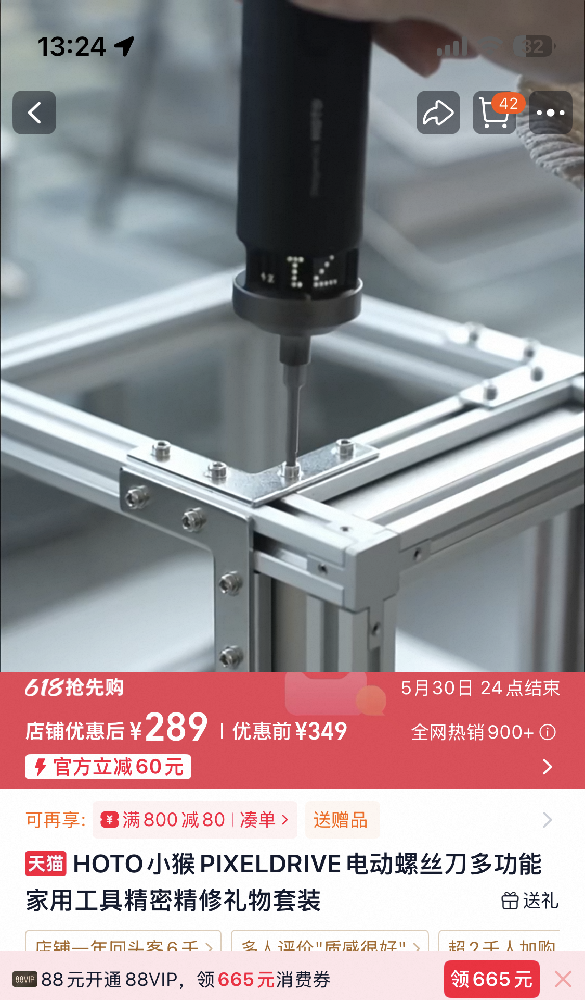

# HOTO 小猴 PIXELDRIVE 电动螺丝刀采购

- 申报日期: 2026-05-27
- 申报状态: 待提交
- 申报结果: 待补充
- 成功情况: 待补充
- 负责人: 待补充
- 申报书: [申报书.md](./申报书.md)

## 图片文案资料

### 商品信息

- 商品名称: HOTO 小猴 PIXELDRIVE 电动螺丝刀多功能家用工具精密精修礼物套装
- 申报名称: HOTO 小猴 PIXELDRIVE 精密电动螺丝刀采购
- 选定规格: HOTO 小猴 PIXELDRIVE 电动螺丝刀套装
- 主要用途: 用于实验室开发板、传感器样机、雷达采集外壳、3D 打印结构件和小型机电组件的精密拆装、装配和维护。
- 资料来源: 商品页面价格记录：店铺优惠后 289.00 元，优惠前 349.00 元。

### 图片

- 小猴 PIXELDRIVE 商品与价格截图: 

### 文案

本项目拟采购 HOTO 小猴 PIXELDRIVE 精密电动螺丝刀套装一套，用于实验室小型硬件样机、雷达采集结构件、开发板外壳、传感器固定件和 3D 打印治具的日常拆装维护。实验室硬件项目通常涉及多种螺丝规格、不同深度的沉孔、塑料件与金属件混合装配，以及需要反复拆装验证的结构件。现有普通手动工具型号有限，遇到小规格、深孔、异形或较密集的螺丝时，容易出现批头不匹配、受力不稳、拧动效率低和重复拆装损伤的问题。

精密电动螺丝刀的价值不只是省力，而是让拆装动作更稳定、更可控。旧批头磨损或型号不匹配时，常见风险包括螺丝头滑牙、批头打滑、手部被尖锐边缘划伤、工具突然偏移压到电路板元件、塑料柱开裂或螺纹柱损坏。对于学生参与样机搭建、板卡调试和外壳装配的场景，工具不合适会显著增加操作挫败感和安全风险，也会把本应投入到实验验证的时间消耗在反复找工具、换工具和处理损伤上。

电动螺丝刀套装能够提供更完整的常用批头体系和更稳定的拧装体验，适合小型结构件高频拆装。对于雷达采集盒、传感器安装支架、控制板外壳、实验台小型夹具和 3D 打印样机而言，螺丝连接虽然是基础环节，但直接影响结构可靠性、拆装效率和实验安全。采购该工具可补齐实验室精密装配工具短板，形成一套可在多个硬件项目之间复用的基础工具条件。

### 资料提取结论

| 资料项 | 访问结果 | 对申报的作用 |
| --- | --- | --- |
| 商品与价格截图 | HOTO 小猴 PIXELDRIVE 电动螺丝刀套装，店铺优惠后 289.00 元 | 支撑价格记录 |
| 商品名称 | 多功能家用工具精密精修套装 | 支撑精密拆装用途 |
| 使用场景图 | 电动螺丝刀用于型材结构件螺丝装配 | 支撑实验室结构件和样机装配场景 |

## 申报成功情况

- 当前状态: 待提交
- 结果说明: 待提交后补充
- 复盘记录: 待补充

## 价格情况

| 项目 | 数量 | 单价(CNY) | 小计(CNY) |
| --- | ---: | ---: | ---: |
| HOTO 小猴 PIXELDRIVE 电动螺丝刀套装 | 1 | 289.00 | 289.00 |
| 合计 |  |  | 289.00 |

## 采购理由

- 现有普通手动工具批头型号有限，难以覆盖开发板、传感器外壳、雷达采集盒和 3D 打印结构件中的多种螺丝规格。
- 批头磨损或尺寸不匹配时，容易造成螺丝滑牙、工具打滑、手部划伤和板卡元件损伤，影响学生参与硬件装配的安全性。
- 电动螺丝刀可提高高频拆装效率，减少重复拧动造成的疲劳和操作误差。
- 精密套装可服务多个实验项目，包括雷达采集终端、心电心音采集板外壳、自制控制板卡和实验支架。
- 该工具复用频率高，适合作为实验室精密装配基础工具补充。

## 使用计划

1. 用于开发板外壳、雷达采集盒、传感器固定件和 3D 打印结构件的拆装维护。
2. 在样机联调过程中承担快速开盖、换板、固定支架和重新装配等操作。
3. 与现有手动工具配合使用，根据螺丝规格选择合适批头，减少滑牙和打滑风险。
4. 用于学生参与硬件调试时的基础工具条件，降低因工具不匹配带来的操作风险。
5. 在后续样机制作中形成常用批头和适用场景记录。

## 验收标准

- 电动螺丝刀主机和配套批头套装数量、外观和基础功能检查完成。
- 能够完成常见小型螺丝的拆卸和安装，批头匹配开发板、外壳、型材连接件和 3D 打印结构件常见规格。
- 在一次样机或结构件拆装中完成实际使用验证。
- 形成适用于实验室小型硬件装配的常用工具和批头使用记录。
