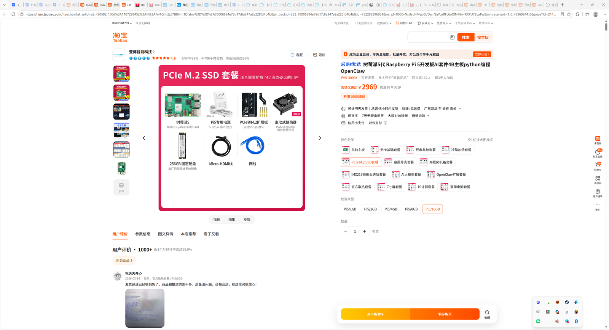

# 树莓派 SSD 采集计算套件采购

- 申报日期: 2026-05-25
- 申报状态: 待提交
- 申报结果: 待补充
- 成功情况: 待补充
- 负责人: 待补充
- 申报书: [申报书.docx](./申报书.docx)

## 图片文案资料

### 商品信息

- 商品名称: 树莓派5 Raspberry Pi 5 开发板 AI 套件 4B 主板 python 编程 OpenClaw
- 申报名称: 树莓派 Linux 开发板 SSD 采集计算套件采购
- 选定规格: Raspberry Pi 5 / 16GB + PCIe M.2 SSD 套餐，含 256GB SSD、PD 电源、PCIe M.2 扩展板、散热器、Micro-HDMI 线和网线
- 主要用途: 用于雷达与心音、心电同步采集系统的 Linux 计算端、边缘缓存和数据归档节点。
- 资料来源: 淘宝桌面版截图记录：PCIe M.2 SSD 套餐、Pi5/16GB 规格，店铺优惠后 ¥2969。

### 图片

- 树莓派5 PCIe M.2 SSD 套餐价格截图: 

### 文案

本项目拟采购树莓派 5 Linux 开发板 SSD 套件，作为雷达与心音、心电同步采集系统的便携式高性能计算终端。该套餐包含 Raspberry Pi 5 16GB 主板、PCIe M.2 扩展板、256GB 固态硬盘、主动散热器、PD 电源、Micro-HDMI 线和网线，可组成小体积、低功耗、可移动部署的 Linux 同步采集与计算节点。相较于普通单板机或只依赖 SD 卡的采集方案，该套件具备更高内存余量、更稳定的本地高速存储和更完整的散热供电条件，适合承担多进程同步采集、时间戳对齐、边缘缓存、轻量预处理和数据归档工作。

雷达、心音和心电同步采集不是单一传感器接入问题，而是多源数据在同一实验场景下的连续接入、缓存、校验、计算和归档问题。雷达端可能产生连续帧数据，心音和心电端需要保持稳定采样和时间记录，采集端还要承担实验编号、文件命名、质量标记和远程管理。若依赖普通笔记本临时连接，设备接口、供电、环境配置和数据目录容易随实验人员变化而变化；若依赖低规格单板机和 SD 卡，长时间写入会成为可靠性瓶颈。采购完整 SSD 套件的必要性在于把采集、缓存和计算能力固化为一台实验室可复用的便携终端，使后续样机联调、数据集建设和论文实验都有稳定入口。

16GB 内存和 PCIe M.2 SSD 是本项目价格较高但必要的主要原因。16GB 内存可为雷达采集进程、心音心电采集进程、数据队列、质量检查脚本、文件打包任务和远程管理服务同时运行预留余量，降低多进程并发时丢帧、阻塞和异常退出的风险。PCIe M.2 SSD 则用于承担连续采集的本地高速缓存，避免 SD 卡在高频写入、长时间实验和反复擦写场景下的速度衰减与损耗。主动散热和稳定 PD 供电可以减少长时间采集中的降频和电源不稳，使该终端更适合随实验场景移动部署。

### 资料提取结论

| 资料项 | 访问结果 | 对申报的作用 |
| --- | --- | --- |
| 淘宝截图 | 选中 PCIe M.2 SSD 套餐、Pi5/16GB，优惠后 ¥2969 | 支撑预算金额 |
| 套餐构成 | 主板、PD 电源、M.2 扩展、散热器、256GB SSD、线材 | 支撑采集计算端可直接部署 |
| 实验用途 | Linux 同步采集、SSD 缓存、边缘计算、网络传输 | 支撑雷达/心音/心电同步采集、在线质量检查与归档 |

## 申报成功情况

- 当前状态: 待提交
- 结果说明: 待提交后补充
- 复盘记录: 待补充

## 价格情况

| 项目 | 数量 | 单价(CNY) | 小计(CNY) | 备注 |
| --- | ---: | ---: | ---: | --- |
| Raspberry Pi 5 16GB PCIe M.2 SSD 套餐 | 1 | 2969.00 | 2969.00 | 淘宝桌面版截图价格，含 256GB SSD 与配套电源/扩展/线材 |
| 合计 |  |  | 2969.00 | 当前记录价 |

## 采购理由

- 雷达与心音、心电同步采集需要一个稳定的 Linux 高性能计算端，同时承担多设备数据接入、时间戳对齐、边缘缓存、数据质量检查和网络传输。
- PCIe M.2 SSD 套餐提供本地高速存储，适合连续采集时先缓存再离线整理，降低 SD 卡写入瓶颈和损耗，提升长时间采集可靠性。
- 16GB 内存规格为多进程采集、实时队列缓存、轻量预处理、文件打包和远程管理预留余量，避免采集过程中因内存不足导致数据丢失。
- 配套 PD 电源和主动散热器有助于长时间采集稳定运行，降低电源不足和过热降频风险，使其更适合作为实验室可移动采集终端。
- 树莓派生态成熟，便于部署 Python、串口、声卡、网络、数据同步和边缘计算工具，适合作为实验室通用同步采集计算平台。
- 该终端可以作为实验室统一的采集计算节点，沉淀采集脚本、数据目录规范、质量检查流程和远程管理方式，减少每次实验重新搭环境带来的时间成本。

## 使用计划

1. 建立雷达、心音、心电多源同步采集流程，实现统一实验编号、统一时间戳记录和统一数据目录结构。
2. 将雷达数据、心音/心电数据写入 SSD 本地高速缓存，并完成采集过程中的数据完整性检查。
3. 运行边缘计算脚本，对采集数据进行轻量预处理、片段切分、质量标记和归档打包。
4. 完成一次便携式 Linux 同步采集高性能终端的完整联调，覆盖数据接入、缓存、计算、归档和远程管理。
5. 形成实验室可复用的同步采集终端配置、采集脚本组织方式和数据归档规范。

## 验收标准

- 形成一套便携迷你的 Linux 同步采集高性能终端。
- 能够完成雷达与心音/心电数据同步采集、边缘缓存和轻量计算。
- 采集数据能够稳定写入 SSD，并按实验编号自动归档。
- 能够支撑实验室后续多模态数据集构建、算法验证和样机联调。
