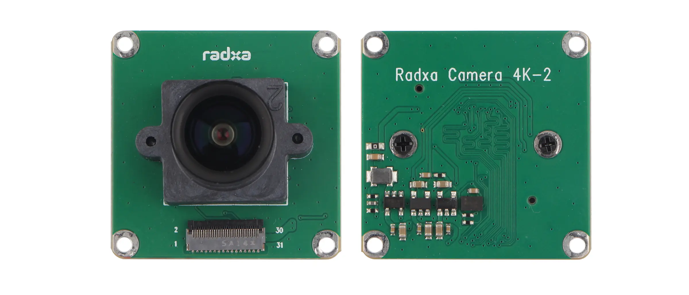
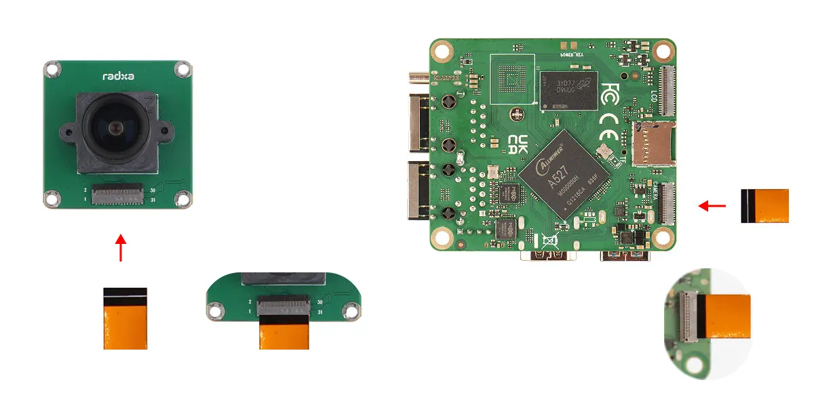
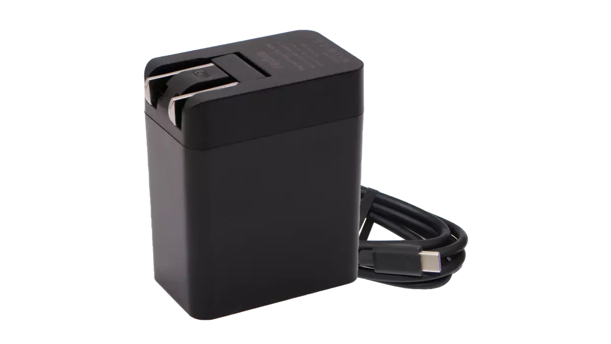
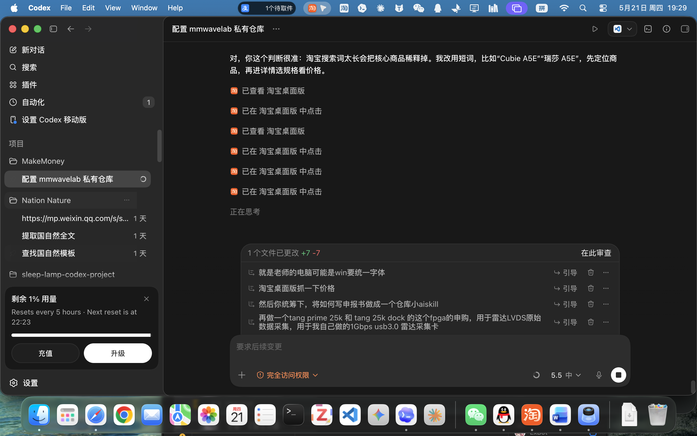
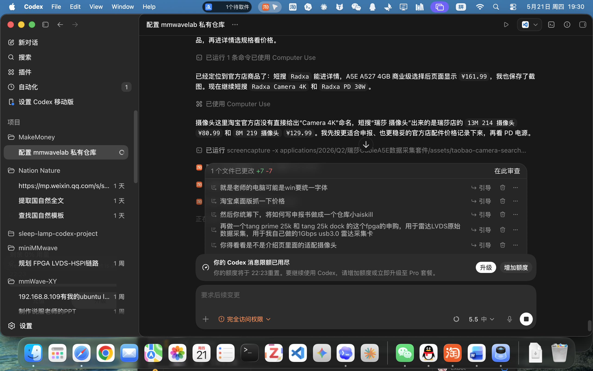

# 双网口数据采集计算终端套件采购

- 申报日期: 2026-05-21
- 申报状态: 待提交
- 申报结果: 待补充
- 成功情况: 待补充
- 负责人: 待补充
- 申报书: [申报书.docx](./申报书.docx)

## 图片文案资料

### 商品信息

- 商品名称: 瑞莎 Radxa Cubie A5E 迷你主板 全志 A527 8核CPU 双千兆网口
- 申报名称: Radxa Cubie A5E 4GB 商业级计算终端套件
- 选定规格: Cubie A5E 商业级 / A527 SoC / 4GB 内存
- 配套内容: Radxa Camera 4K 摄像头模块、Radxa Power PD 30W 电源适配器
- 淘宝链接: https://e.tb.cn/h.RcBfbN5y7bpWvFl?tk=XErF5GXZpEW
- 淘宝商品 ID: `871582539578`
- 口令: `XErF5GXZpEW`
- 访问记录: 2026-05-21 访问淘宝短链，短链可解析到商品 ID；淘宝桌面版已记录 4GB 商业级规格、配套 Camera 4K 和 PD 30W 的官方店搜索价格截图。
- 官方产品页: https://radxa.com/products/cubie/a5e
- 官方文档页: https://docs.radxa.com/cubie/a5e
- 官方配件页: https://docs.radxa.com/cubie/a5e/accessories
- 资料来源: 用户提供淘宝商品链接；产品外观、接口与规格参数参考 Radxa 官方产品页和官方文档。

### 图片

- 产品外观图: 
- 接口标注图: 
- 配套摄像头: 
- 摄像头连接示意: 
- PD 电源适配器: 
- A5E 4GB 商业级淘宝价格截图: 
- Camera 4K 淘宝价格截图: 
- Power PD 30W 淘宝价格截图: 
- 待补充: 用于展示采集系统连接关系的方案图，建议保存到 `assets/system-connection.png`。

### 文案

本项目拟购置 Radxa Cubie A5E 数据采集套件，核心为 Cubie A5E 商业级 A527 SoC / 4GB 内存计算终端，并配套 Radxa Camera 4K 摄像头模块和 Radxa Power PD 30W 电源适配器。该套件作为双网口数据采集边缘计算终端平台，用于多设备数据接入、网络隔离、视觉辅助采集、边缘缓存与转发。官方资料显示，Cubie A5E 可选全志 A527 SoC 或工业级 T527 SoC，搭载 8 核 Arm Cortex-A55 CPU；A527 版本支持 LPDDR4/LPDDR4x 内存、microSD/eMMC/M.2 NVMe 存储、2 个千兆以太网口、Wi-Fi 6、蓝牙 5.4、USB 3.0、USB Type-C OTG、40 Pin GPIO，以及 M.2 M Key 2230 扩展。

该主控板后续可用于雷达生命体征信号与心音、心电同步采集实验，支持算法验证、数据集构建、设备联调和原型系统迭代。双千兆网口便于将雷达设备网络与实验室上位机/局域网分离，降低网络冲突和带宽争用；M.2 M Key 2230 NVMe 可安装小尺寸固态硬盘，用于连续采集时的本地高速缓存和离线备份；USB 3.0 与 USB Type-C OTG 可用于连接声卡、串口转换器或采集外设；40 Pin GPIO 可用于触发、同步、I2C/SPI/UART 控制；配套 Camera 4K 可通过 MIPI CSI 接口接入，用于采集现场画面、受试者状态记录或视觉辅助标注；Power PD 30W 用于提供稳定供电，降低外设接入时因供电不足导致的采集中断风险。

Cubie A5E 的一个值得重点学习和使用的新架构特征，是内置独立 RISC-V MCU，可运行 RTOS，用于更贴近硬件侧的实时控制。对于数据采集系统而言，这意味着主 Linux 系统可负责网络、文件、上位机通信和脚本调度，RISC-V MCU 则可承担触发、同步、状态监测、低延迟控制等实时任务。该架构把“高层数据处理”和“底层实时控制”分层，特别适合作为实验室后续边缘采集设备的学习样机和原型平台。

### 资料提取结论

| 资料项 | 访问结果 | 对申报的作用 |
| --- | --- | --- |
| 淘宝短链 | 可访问，解析到商品 ID `871582539578` | 证明采购对象对应实际商品页 |
| 选定规格 | 商业级 / A527 SoC / 4GB 内存 | 明确本次采购不选择工业级 T527，控制预算并满足采集节点需求 |
| 淘宝详情页 | 已确认 A5E A527 4GB 商业级规格，官方店价格截图为 `¥161.99` | 支撑主控板预算金额 |
| 淘宝搜索页 | 已确认官方店 Camera 4K 价格 `¥202.99`、Power PD 30W 价格 `¥6.00` | 支撑配套摄像头和供电配件预算金额 |
| Radxa 官方产品页 | 可访问，提供产品定位和核心卖点 | 支撑设备名称、网络能力和边缘主控定位 |
| Radxa 官方文档 | 可访问，提供规格表和接口说明 | 支撑 8 核 CPU、双千兆、USB、GPIO、M.2 等技术论证 |
| Radxa 官方配件页 | 列出 Power PD 30W、Camera 4K 等 Cubie A5E 兼容配件 | 支撑摄像头和 PD 充电器作为本次配套采购项 |

## 申报成功情况

- 当前状态: 待提交
- 结果说明: 待提交后补充
- 复盘记录: 待补充

## 价格情况

| 项目 | 数量 | 单价(CNY) | 小计(CNY) | 备注 |
| --- | ---: | ---: | ---: | --- |
| Radxa Cubie A5E 4GB 商业级计算终端 | 1 | 161.99 | 161.99 | A527 SoC，双千兆网口，淘宝商品 ID `871582539578`；淘宝桌面版截图价 |
| Radxa Camera 4K 摄像头模块 | 1 | 202.99 | 202.99 | MIPI CSI 摄像头，用于现场画面和视觉辅助采集；官方兼容配件 |
| Radxa Power PD 30W 电源适配器 | 1 | 6.00 | 6.00 | 官方兼容电源，提供稳定 30W 供电 |
| M.2 2230 NVMe SSD | 1 | 0 | 0 | 可选扩展项，优先使用实验室库存；如需另购再单独申报 |
| 合计 |  |  | 370.98 | 本表为淘宝桌面版当前记录价；实际支出以下单页和发票/订单为准 |

## 采购理由

- 支撑雷达/心音/心电多模态同步采集系统搭建。
- 作为边缘主控节点，减少采集电脑直接连接多设备造成的端口、驱动、权限和网络配置复杂度。
- 双千兆网口适合雷达数据网络与上位机/实验室局域网分离，提高联调稳定性，并为后续网络隔离实验预留条件。
- M.2 M Key 2230 NVMe 可安装小尺寸固态硬盘，适合连续采集数据的高速边缘缓存和离线转移。
- 独立 RISC-V MCU 可运行 RTOS，适合学习和实现采集系统中的触发、同步、低延迟控制和硬件状态监测。
- USB 3.0、USB Type-C OTG、40 Pin GPIO、MIPI CSI 和 M.2 NVMe 扩展覆盖数据接入、视觉采集、触发同步、控制通信和本地缓存五类需求。
- Camera 4K 可以作为实验现场画面记录和视觉辅助标注输入，帮助同步核对雷达/心音/心电采集过程。
- Power PD 30W 是官方兼容供电配件，有助于保证计算终端与外设工作时的稳定供电。
- 8 核 Cortex-A55 处理器适合运行采集守护进程、轻量滤波/质量检查、时间戳记录和数据转发服务。
- 体积小、功耗相对可控，适合桌面实验、移动采集箱和原型系统集成。

## 使用计划

1. 完成计算终端系统烧录、PD 供电验证、网络配置与远程管理环境配置。
2. 安装或验证 M.2 2230 NVMe 存储，建立边缘缓存目录和数据归档规则。
3. 接入雷达设备网络，验证双网口隔离下的数据流接收、缓存和转发。
4. 接入心音/心电采集链路，验证采样时间戳记录和文件归档。
5. 接入 Camera 4K，验证现场图像采集、时间戳记录和实验状态标注。
6. 评估 RISC-V MCU/RTOS 用于触发同步、状态监测和实时控制的开发路径。
7. 形成一次完整联调记录，补充到本 README 的复盘记录中。

## 验收标准

- 计算终端能够稳定启动并完成网络连接。
- 至少完成一次雷达数据与心音/心电数据的同步采集流程验证。
- 采集数据能够按实验编号自动归档。
- Camera 4K 可被系统识别并完成图像采集验证。
- PD 30W 电源可稳定供电，采集过程中无异常断电或重启。
- M.2 2230 NVMe 扩展路径完成可行性验证。
- RISC-V MCU/RTOS 实时控制能力形成初步学习记录或验证计划。
- 采购价格、订单截图、商品截图和到货照片补充到 `assets/`。
