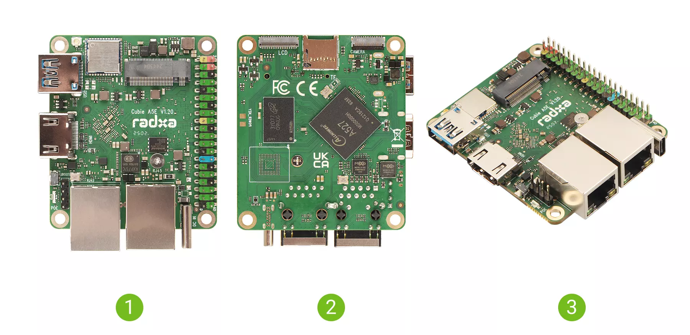
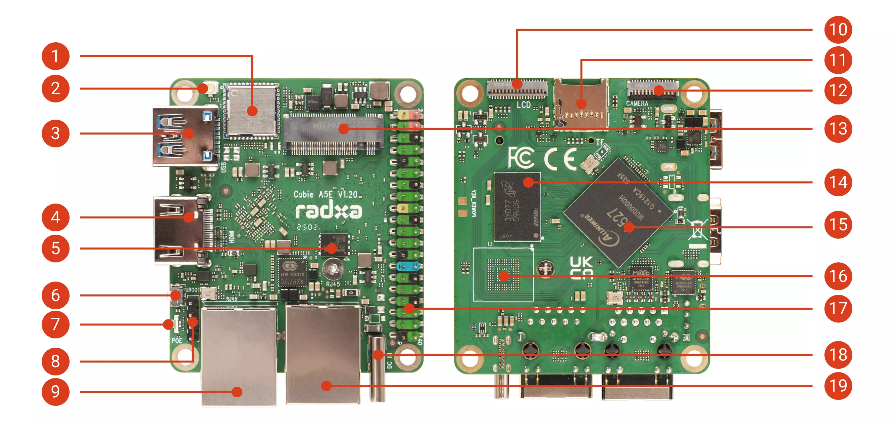
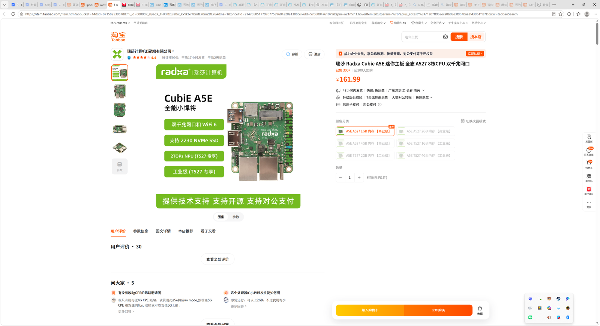
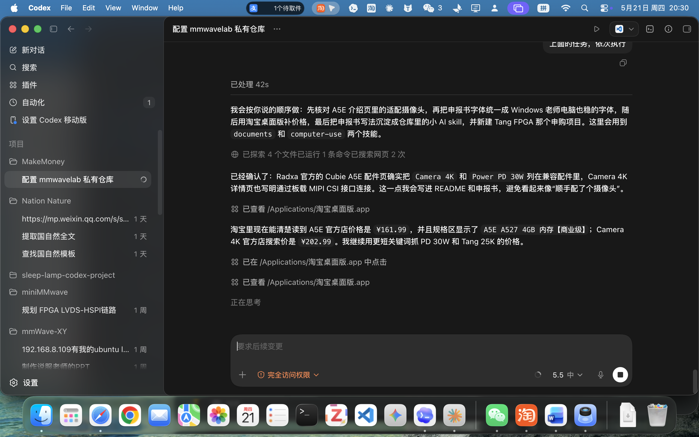

# 双网口数据采集计算终端套件采购

- 申报日期: 2026-05-25
- 申报状态: 待提交
- 申报结果: 待补充
- 成功情况: 待补充
- 负责人: 待补充
- 申报书: [申报书.docx](./申报书.docx)

## 图片文案资料

### 商品信息

- 商品名称: 瑞莎 Radxa Cubie A5E 迷你主板 全志 A527 8核CPU 双千兆网口
- 申报名称: Radxa Cubie A5E 1GB 商业级双网口数据采集计算终端套件
- 选定规格: A5E A527 / 1GB 内存 / 商业级，配套 Radxa Power PD 30W 电源适配器
- 主要用途: 用于雷达与心音、心电同步采集系统的双以太网边缘计算端。
- 资料来源: 淘宝桌面版截图记录 A5E A527 1GB 商业级价格 ¥161.99；既有资料中 PD 30W 电源适配器价格 ¥6.00。

### 图片

- Radxa Cubie A5E 产品外观: 
- Radxa Cubie A5E 接口标注: 
- A5E 1GB 商业级淘宝价格截图: 
- Power PD 30W 淘宝价格截图: 

### 文案

本项目拟购置 Radxa Cubie A5E 1GB 商业级双网口数据采集计算终端及 PD 供电配件。A5E 具备双千兆以太网口、Wi-Fi 6、USB 3.0、40 Pin GPIO 和 M.2 2230 NVMe SSD 扩展能力，可作为雷达与心音、心电同步采集系统中的边缘 Linux 节点。双网口便于将雷达数据网络与实验室局域网或上位机网络隔离，M.2 SSD 适合连续采集时做本地高速缓存，内置 RISC-V MCU 可用于学习实时控制、触发同步和状态监测这一新型异构架构。

### 资料提取结论

| 资料项 | 访问结果 | 对申报的作用 |
| --- | --- | --- |
| 淘宝截图 | A5E A527 1GB 商业级选项，价格 ¥161.99 | 修正预算为 1GB 已确认价 |
| 产品卖点 | 双千兆网口、支持 2230 NVMe SSD、Wi-Fi 6 | 支撑同步采集计算端论证 |
| 架构特征 | Linux 主系统 + 内置 RISC-V MCU | 支撑实时控制和触发同步学习价值 |

## 申报成功情况

- 当前状态: 待提交
- 结果说明: 待提交后补充
- 复盘记录: 待补充

## 价格情况

| 项目 | 数量 | 单价(CNY) | 小计(CNY) | 备注 |
| --- | ---: | ---: | ---: | --- |
| Radxa Cubie A5E 1GB 商业级计算终端 | 1 | 161.99 | 161.99 | A527 SoC，双千兆网口，支持 2230 NVMe SSD |
| Radxa Power PD 30W 电源适配器 | 1 | 6.00 | 6.00 | 官方兼容电源 |
| 合计 |  |  | 167.99 | 当前价格依据本地下载 xls 或淘宝桌面版截图记录，实际支出以下单页和发票/订单为准 |

## 采购理由

- 双千兆网口适合把雷达数据网络与上位机/实验室网络分离，提高联调稳定性。
- M.2 2230 NVMe SSD 扩展可为连续采集提供本地高速缓存，避免只依赖 SD 卡。
- A527 8 核 Linux 平台适合运行采集守护进程、时间戳记录、轻量质量检查和数据转发服务。
- 内置 RISC-V MCU 可用于学习采集系统中的触发、同步、低延迟控制和硬件状态监测。
- 1GB 商业级版本价格明确，预算低，适合作为实验室双网口采集计算端的入门样机。
- PD 30W 电源作为配套供电，降低外设接入时因供电不稳造成采集中断的风险。

## 使用计划

1. 完成 A5E 系统烧录、PD 供电验证和双网口网络配置。
2. 验证 M.2 2230 NVMe SSD 扩展路径，建立采集缓存目录。
3. 接入雷达设备网络，验证双网口隔离下的数据接收、缓存和转发。
4. 接入心音/心电采集链路，验证统一时间戳和文件归档规则。
5. 评估 RISC-V MCU 用于触发同步和实时状态监测的开发路径。

## 验收标准

- A5E 能够稳定启动并完成双网口通信测试。
- 能够说明并验证雷达网络与实验室网络隔离的连接方案。
- M.2 2230 NVMe SSD 扩展路径完成可行性验证。
- 至少完成一次雷达与心音/心电同步采集流程演练或连接验证。
- A5E 1GB 价格截图、PD 电源价格截图、订单截图和到货照片归档完整。
